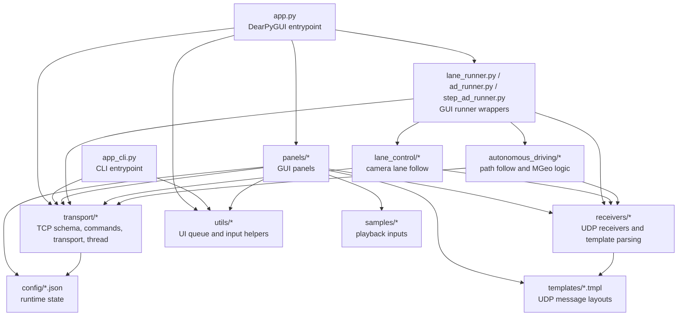
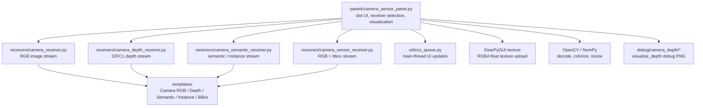
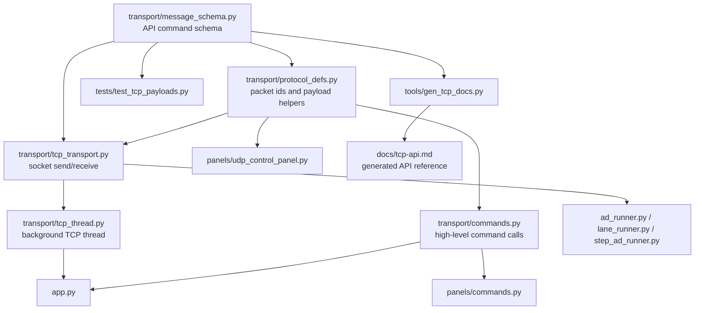
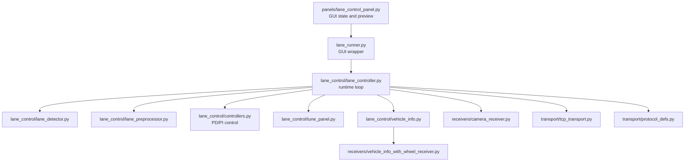
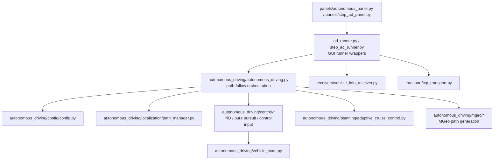

# Code Review Graph

This graph is a review-oriented view of the project. It focuses on ownership boundaries,
runtime data flow, and modules that are risky to change together.

## Top-Level Runtime Graph



## Camera Sensor Review Graph



## TCP/API Review Graph



## Lane Follow Review Graph



## Path Follow Review Graph



## Review Order

1. `transport/message_schema.py`, `transport/protocol_defs.py`, `transport/tcp_transport.py`
2. `receivers/template_parser.py`, then the specific receiver being changed
3. `panels/*` UI integration, checking `utils.ui_queue.post()` for background-thread UI writes
4. Runner wrappers: `lane_runner.py`, `ad_runner.py`, `step_ad_runner.py`
5. Domain logic: `lane_control/*` or `autonomous_driving/*`
6. Docs and tests: `docs/*`, `tools/gen_tcp_docs.py`, `tests/test_tcp_payloads.py`

## High-Risk Review Boundaries

- `panels/*` must not import `app.py`; callbacks should be injected from the entrypoint.
- Background receiver threads must not update DearPyGUI directly; use `utils.ui_queue.post()`.
- UDP camera/template changes should be reviewed with the matching `templates/*.tmpl` file.
- TCP API changes should update `transport/message_schema.py`, regenerate `docs/tcp-api.md`, and run payload tests.
- Depth camera changes should compare three outputs separately: raw receiver stats, `_visualize_depth()` debug PNG, and GUI texture preview.

## Useful Verification Commands

```bash
python -m py_compile app.py panels/camera_sensor_panel.py receivers/camera_depth_receiver.py
python tools/gen_tcp_docs.py --check
python -m unittest tests.test_tcp_payloads
```
